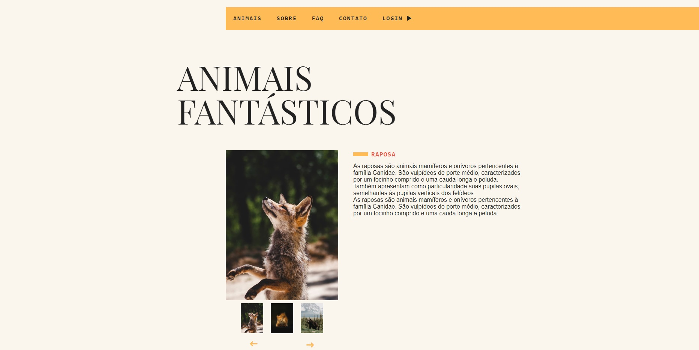

<h1 align="center" >Animais Fantásticos 🦊 - Origamid</h1>

Site de ong de animais para arrecadar doações

## </> **Tecnologias usadas**

As principais tecnologias usadas nesse projeto:

`HTML`

`CSS`

`JAVASCRIPT`

## 📖 **Descrição do Projeto**

Este projeto faz parte do curso de Javascript da Origamid, nele é usado classes para criar funcionalidades como um slide interativo, mostrar se está no horário de funcionamento, criar um modal e várias outras interações pelo site.

## 🔗 **Links**

- Github pages - https://gustavogularte.github.io/projeto-animais-fantasticos/
- Site original - https://www.origamid.com/projetos/animais-fantasticos/
- Linkedin - https://www.linkedin.com/in/gustavo-gularte-58742a286
- Meu Twitter - https://twitter.com/gustavoGulArend
- Meu perfil no Front End Mentor com mais desafios - https://www.frontendmentor.io/profile/gustavogularte
